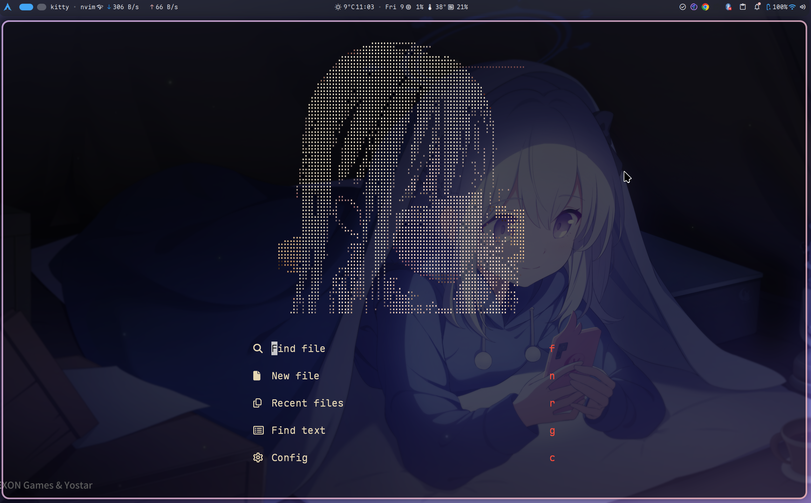

# Neovim 配置（基于 LazyVim + lazy.nvim）

这是我的 `~/.config/nvim` 配置仓库：以 **LazyVim** 作为基础发行版，用 **lazy.nvim** 进行插件管理，并在 `lua/config/` 与 `lua/plugins/` 里做了大量个性化配置（主题、状态栏、FZF、DAP、CopilotChat、CMake、终端等）。

## 预览

## 目录

- [环境与依赖](#环境与依赖)
- [安装与启动](#安装与启动)
- [项目结构](#项目结构)
- [核心配置说明](#核心配置说明)
- [LazyVim Extras（lazyvim.json）](#lazyvim-extraslazyvimjson)
- [插件与配置](#插件与配置)
  - [本仓库显式配置/覆盖（lua/plugins）](#本仓库显式配置覆盖luaplugins)
  - [完整插件列表（lazy-lock.json）](#完整插件列表lazy-lockjson)
- [快捷键（重点）](#快捷键重点)
  - [记号说明](#记号说明)
  - [通用（lua/config/keymaps.lua）](#通用luaconfigkeymapslua)
  - [终端（内置终端 + ToggleTerm）](#终端内置终端--toggleterm)
  - [搜索/查找（FzfLua）](#搜索查找fzflua)
  - [LSP](#lsp)
  - [调试（DAP）](#调试dap)
  - [CMake（cmake-tools.nvim）](#cmakecmake-toolsnvim)
  - [AI（Copilot / CopilotChat）](#aicopilot--copilotchat)
  - [问题列表（Trouble）](#问题列表trouble)
  - [消息/UI（Noice）](#消息uinoice)
  - [快捷键提示（which-key）](#快捷键提示which-key)
  - [启动页（alpha-nvim）](#启动页alpha-nvim)
  - [自动命令相关（lua/config/autocmds.lua）](#自动命令相关luaconfigautocmdslua)
- [维护与排错](#维护与排错)

## 环境与依赖

- 必需：
  - Neovim：建议 `>= 0.11`（当前环境为 `NVIM v0.11.5`）
  - Git：用于首次拉取 `lazy.nvim` 与插件更新
- 强烈建议：
  - `rg`（ripgrep）：用于更快的 `:grep`/搜索（`opt.grepprg = "rg --vimgrep"`）
  - `fzf`：`fzf-lua` 通常需要系统已安装 `fzf` 可执行文件
  - `fd`：供搜索/文件查找类插件使用（如 `Snacks.picker`/`fzf-lua`）
- 语言与 LSP 相关（按需安装）：
  - C/C++/CMake：`cmake`、`clangd` 或 `gcc/clang`、以及构建工具（Ninja/Make）
  - Python：`python3` + `pynvim`
  - Node.js：`node` + `npm` + `neovim` npm 包（`npm i -g neovim`）
  - Rust：`rust-analyzer`（推荐配合 `rustup`）
- 调试（可选）：
  - DAP 相关：通过 `:Mason` 安装调试适配器（例如 C/C++ 常用 `codelldb`）
- 图片/文档渲染（可选）：
  - `3rd/image.nvim`：配置为 `backend = "kitty"`，建议在 Kitty 终端使用
  - `leafo/magick`：需要 `luarocks` + ImageMagick（用于 `processor = "magick_rock"`）
  - Mermaid：`@mermaid-js/mermaid-cli`（`mmdc`）
  - LaTeX：`tectonic` 或 `texlive`
- 其他（可选）：
  - `lazygit`：若使用相关快捷键/集成
  - Neovide：如果你用 Neovide，会启用 `lua/config/options.lua` 内的 Neovide 专用配置（字体、背景图、透明度等）

## 安装与启动

1. 备份你的旧配置：`mv ~/.config/nvim ~/.config/nvim.bak`
2. 将本仓库放到：`~/.config/nvim`
3. 直接运行 `nvim`
   - 首次启动会自动安装 `lazy.nvim`（见 `lua/config/lazy.lua` 的 bootstrap 逻辑）
   - 之后会按 `lazy-lock.json` 同步插件版本
4. 常用维护命令
   - `:Lazy`：插件管理（更新/清理/性能等）
   - `:Mason`：LSP/DAP/格式化器等外部工具管理
   - `:LazyExtras`：启用/禁用 LazyVim Extras（会写入 `lazyvim.json`）

## 项目结构

- `init.lua`：入口，只做一件事：`require("config.lazy")`
- `lua/config/`
  - `lua/config/lazy.lua`：`lazy.nvim` 安装引导 + `require("lazy").setup(...)`
  - `lua/config/options.lua`：Neovim/Neovide 选项、全局变量、UI/编辑行为等
  - `lua/config/keymaps.lua`：我的自定义快捷键（不含各插件的 `keys = {...}`）
  - `lua/config/autocmds.lua`：自动命令（checktime、yank 高亮、q 关闭特殊窗口、保存自动建目录等）
- `lua/plugins/`：**所有插件“显式配置/覆盖”的地方**（lazy.nvim 会自动加载该目录下每个文件）
- `lazyvim.json`：LazyVim Extras 开关清单（相当于 “我启用了哪些模块”）
- `lazy-lock.json`：锁定插件 commit 的版本文件（保证可复现）
- `cmake/`
  - `cmake/cmake-kits.json`：cmake-tools 的 Kit 列表（编译器选择）
  - `cmake/generate_kits.sh`：扫描编译器并生成 `cmake-kits.json`（依赖 `jq`）
- `generated.lua`：Matugen 生成的主题片段（依赖 `base16-colorscheme`；**当前未自动加载**，且本仓库未显式安装该插件。如要使用请先添加对应插件并自行加载）

## 核心配置说明

### 1) 插件系统：lazy.nvim + LazyVim

- `lua/config/lazy.lua` 会：
  - 自动安装 `lazy.nvim` 到 `~/.local/share/nvim/lazy/lazy.nvim`
  - 通过 `spec` 导入：
    - `LazyVim/LazyVim`（并 `import = "lazyvim.plugins"`）
    - 本仓库的 `lua/plugins/`（`import = "plugins"`）
  - 禁用部分内置 runtime 插件以加速启动（gzip/tarPlugin/zipPlugin/tohtml/tutor 等）

### 2) 基础选项（节选）

这些内容位于 `lua/config/options.lua`：

- Leader 键：`vim.g.mapleader = " "`（空格），`vim.g.maplocalleader = "\\"`
- 根目录检测：`vim.g.root_spec = { "lsp", { ".git", "lua" }, "cwd" }`，并忽略 `copilot` 作为根目录来源：`vim.g.root_lsp_ignore = { "copilot" }`
- Fuzzy Finder：`vim.g.lazyvim_picker = "fzf"`
- 补全引擎：`vim.g.lazyvim_cmp = "auto"`，并倾向 AI 补全源：`vim.g.ai_cmp = true`
- 默认关闭 Copilot：`vim.g.copilot_enabled = false`（可用快捷键开启/关闭，见下文）
- JSON 文件不隐藏引号：在 `lua/config/autocmds.lua` 里对 `json/jsonc/json5` 强制 `conceallevel = 0`
- 文本类文件自动 `wrap + spell`：`text/plaintex/typst/gitcommit`（Markdown 默认只开 `wrap`）

### 3) Neovide 专用配置（节选）

在 `lua/config/options.lua` 中，当检测到 `vim.g.neovide` 时会应用：

- 字体：`JetBrainsMono Nerd Font:h18`
- 光标特效：`vim.g.neovide_cursor_vfx_mode = "railgun"`
- 缩放：`vim.g.neovide_scale_factor = 0.9`
- 背景图：`~/background/1.png`
- 背景透明度：`vim.g.neovide_background_transparency = 0.5`

## LazyVim Extras（lazyvim.json）

本仓库启用的 Extras（见 `lazyvim.json`）：

- `lazyvim.plugins.extras.ai.copilot`：GitHub Copilot（配合 `blink-copilot`/补全引擎）
- `lazyvim.plugins.extras.ai.copilot-chat`：Copilot Chat（本仓库另有更细的 UI/按键配置，见 `lua/plugins/copilot-chat.lua`）
- `lazyvim.plugins.extras.dap.core`：DAP 基础能力（本仓库同样做了深度定制，见 `lua/plugins/dap.lua`）
- `lazyvim.plugins.extras.lang.clangd`：C/C++（clangd）相关
- `lazyvim.plugins.extras.lang.cmake`：CMake 相关
- `lazyvim.plugins.extras.lang.json`：JSON 相关（含 SchemaStore）
- `lazyvim.plugins.extras.lang.markdown`：Markdown 相关
- `lazyvim.plugins.extras.lang.python`：Python 相关（含 venv-selector 等）
- `lazyvim.plugins.extras.lang.rust`：Rust 相关（含 rustaceanvim/crates 等）
- `lazyvim.plugins.extras.lang.toml`：TOML 相关
- `lazyvim.plugins.extras.ui.alpha`：Alpha 启动页（本仓库自定义启动页：`lua/plugins/my-alpha.lua`）
- `lazyvim.plugins.extras.util.gitui`：集成 GitUI（终端 Git 工具）

## 插件与配置

### 本仓库显式配置/覆盖（lua/plugins）

下面按文件说明「我显式写过的插件配置」以及关键点：

#### 主题与透明

- `lua/plugins/colorscheme.lua`
  - `ellisonleao/gruvbox.nvim`：主题
  - 覆盖 `LazyVim/LazyVim`：`colorscheme = "gruvbox"`
  - `xiyaowong/transparent.nvim`：透明背景（**仅在非 Neovide 启用**），并在启动时 `:TransparentEnable`

#### 状态栏

- `lua/plugins/lualine.lua`
  - `nvim-lualine/lualine.nvim`
  - 自定义「Gruvbox 配色 + 全透明背景」主题
  - lualine_x 显示：Snacks profiler / Noice 状态 / DAP 状态 / lazy 更新提示 / diff
  - lualine_y 显示：当前 buffer 挂载的 LSP client 列表、encoding/fileformat 等
  - Trouble symbols 可选集成（`vim.g.trouble_lualine = true`）

#### 快捷键提示

- `lua/plugins/which-key.lua`
  - `folke/which-key.nvim`
  - 使用 `preset = "helix"`，并给 `<leader>` 常见前缀设置分组名称

#### 搜索/选择器：FzfLua

- `lua/plugins/fzf.lua`
  - `ibhagwan/fzf-lua`
  - 注册 `LazyVim.pick` 的 fzf picker（让 `LazyVim.pick(...)` 系列快捷键可用）
  - 定制 fzf 内部按键（如 `ctrl-q` 全选并确认、`ctrl-r/alt-c` 切换 root/cwd 等）
  - 自动接管 `vim.ui.select`（VeryLazy 后生效）

#### LSP

- `lua/plugins/lsp.lua`
  - `neovim/nvim-lspconfig` + `mason.nvim` + `mason-lspconfig.nvim`
  - 诊断显示：虚拟文本前缀 `●`、排序、sign 图标等
  - Inlay hints：默认开启（排除 `vue`）
  - Folding：默认开启（会把 foldmethod 切到 LSP expr）
  - `lua_ls`：`mason = false`（不通过 Mason 安装），并设置一系列 Lua hints/补全行为
  - `basedpyright`：`typeCheckingMode = "basic"`，workspace 级别诊断等

#### Treesitter

- `lua/plugins/nvim-treesitter.lua`
  - `nvim-treesitter/nvim-treesitter`（main 分支）
  - 默认安装的 parser 列表包含：`lua/python/c/cpp/json/markdown/toml/yaml/...`

#### 补全

- `lua/plugins/completion.lua`
  - `saghen/blink.cmp`
  - 主要调整：`<Tab>/<S-Tab>` 在补全菜单中选择上一/下一项（`preset = "enter"` 保持回车确认）

#### AI（Copilot / CopilotChat）

- `lua/plugins/copilot-chat.lua`
  - `zbirenbaum/copilot.lua`
  - `CopilotC-Nvim/CopilotChat.nvim`
    - `system_prompt` 强制中文回复
    - 窗口布局：竖向，宽度约 30%
    - chat buffer 进入时关闭行号/相对行号
    - 定义了 chat buffer 内的按键（`gd` 看 diff、`q` 关闭等）

#### 调试（DAP）

- `lua/plugins/dap.lua`
  - `mfussenegger/nvim-dap`
  - `rcarriga/nvim-dap-ui` + `theHamsta/nvim-dap-virtual-text`
  - 自动化钩子：调试开始自动打开 dap-ui，结束自动关闭，并尝试关闭文件树
  - 额外增强：自定义“反汇编视图”（`<leader>dd`）与“内存查看器”（`<leader>dm`）

#### CMake

- `lua/plugins/cmake_tools.lua`
  - `Civitasv/cmake-tools.nvim`（检测到项目根有 `CMakeLists.txt` 才会加载）
  - Kit 文件：`cmake/cmake-kits.json`
  - Build 使用 quickfix，Run 使用 toggleterm float
  - Debug 配置：`codelldb`

#### 终端

- `lua/plugins/toggleterm.lua`
  - `akinsho/toggleterm.nvim`
  - 默认浮动终端：`<c-t>`
  - 额外“工具终端”：
    - `<leader>oc`：OpenCode（运行 `opencode`）
    - `<leader>oi`：Codex（运行 `codex`）
    - 特性：当工作目录变化时会销毁旧实例并在新 cwd 里重建

#### Trouble（诊断/列表）

- `lua/plugins/trouble.lua`
  - `folke/trouble.nvim`
  - LSP 模式窗口默认在右侧

#### Noice（消息/UI）

- `lua/plugins/noice.lua`
  - `folke/noice.nvim`
  - 优化 LSP markdown 渲染；过滤一些“xxL, yyB”类消息到 mini view；启用 bottom_search/command_palette 等 presets

#### Markdown / 图片 / LeetCode / Rust / Breadcrumb

- `lua/plugins/markdown_render.lua`
  - `MeanderingProgrammer/render-markdown.nvim`：Markdown 标题渲染（自定义图标）
- `lua/plugins/img.lua`
  - `3rd/image.nvim` + `leafo/magick`：在 Kitty 等终端渲染图片（允许下载远程图片）
- `lua/plugins/leetcode.lua`
  - `kawre/leetcode.nvim`：LeetCode（默认 C++，启用 leetcode.cn 翻译）
- `lua/plugins/rust.lua`
  - `mrcjkb/rustaceanvim`：Rust 工具链集成
- `lua/plugins/nvim-navic.lua`
  - `SmiteshP/nvim-navic`：LSP breadcrumb（用于状态栏/当前位置提示）
- `lua/plugins/my-alpha.lua`
  - `goolord/alpha-nvim`：启动页 + 随机 Header（来自 `lua/plugins/header_img/`）

### 完整插件列表（lazy-lock.json）

下面是“实际安装并锁定版本”的完整插件列表（按插件目录名排序，包含仓库与锁定 commit）：

| 插件 | 仓库 | 锁定 commit |
|---|---|---|
| `CopilotChat.nvim` | <https://github.com/CopilotC-Nvim/CopilotChat.nvim> | `9db5d3eaafe9fc3c91ce9ecfc416de2798982487` |
| `LazyVim` | <https://github.com/LazyVim/LazyVim> | `28db03f958d58dfff3c647ce28fdc1cb88ac158d` |
| `SchemaStore.nvim` | <https://github.com/b0o/SchemaStore.nvim> | `d5687736d15cfc3c1ac943485cad7808ba487d2b` |
| `alpha-nvim` | <https://github.com/goolord/alpha-nvim> | `3979b01cb05734331c7873049001d3f2bb8477f4` |
| `blink-copilot` | <https://github.com/fang2hou/blink-copilot> | `7ad8209b2f880a2840c94cdcd80ab4dc511d4f39` |
| `blink.cmp` | <https://github.com/saghen/blink.cmp> | `b19413d214068f316c78978b08264ed1c41830ec` |
| `bufferline.nvim` | <https://github.com/akinsho/bufferline.nvim> | `655133c3b4c3e5e05ec549b9f8cc2894ac6f51b3` |
| `catppuccin` | <https://github.com/catppuccin/nvim> | `4420f0a50dfde7ee79acf91ded8f97e02883a22a` |
| `clangd_extensions.nvim` | <https://github.com/p00f/clangd_extensions.nvim> | `6fd7f12df71a04dd9ec398fc63aaa23fbe9f525f` |
| `cmake-tools.nvim` | <https://github.com/Civitasv/cmake-tools.nvim> | `f34418d7aa57c730ee91b3e45e7612978506fcf3` |
| `conform.nvim` | <https://github.com/stevearc/conform.nvim> | `8314f4c9e205e7f30b62147069729f9a1227d8bf` |
| `copilot.lua` | <https://github.com/zbirenbaum/copilot.lua> | `e78d1ffebdf6ccb6fd8be4e6898030c1cf5f9b64` |
| `crates.nvim` | <https://github.com/Saecki/crates.nvim> | `ac9fa498a9edb96dc3056724ff69d5f40b898453` |
| `flash.nvim` | <https://github.com/folke/flash.nvim> | `fcea7ff883235d9024dc41e638f164a450c14ca2` |
| `friendly-snippets` | <https://github.com/rafamadriz/friendly-snippets> | `572f5660cf05f8cd8834e096d7b4c921ba18e175` |
| `fzf-lua` | <https://github.com/ibhagwan/fzf-lua> | `a03d68e40eea835a1cdbd9f93049708dab3621e6` |
| `gitsigns.nvim` | <https://github.com/lewis6991/gitsigns.nvim> | `72acb69020c92d99cf388bfeb390481ccec50c04` |
| `grug-far.nvim` | <https://github.com/MagicDuck/grug-far.nvim> | `794f03c97afc7f4b03fb6ec5111be507df1850cf` |
| `gruvbox.nvim` | <https://github.com/ellisonleao/gruvbox.nvim> | `5e0a460d8e0f7f669c158dedd5f9ae2bcac31437` |
| `image.nvim` | <https://github.com/3rd/image.nvim> | `446a8a5cc7a3eae3185ee0c697732c32a5547a0b` |
| `lazy.nvim` | <https://github.com/folke/lazy.nvim> | `85c7ff3711b730b4030d03144f6db6375044ae82` |
| `lazydev.nvim` | <https://github.com/folke/lazydev.nvim> | `5231c62aa83c2f8dc8e7ba957aa77098cda1257d` |
| `leetcode.nvim` | <https://github.com/kawre/leetcode.nvim> | `fdd3f91800b3983e27bc9fcfb99cfa7293d7f11a` |
| `lualine.nvim` | <https://github.com/nvim-lualine/lualine.nvim> | `47f91c416daef12db467145e16bed5bbfe00add8` |
| `magick` | <https://github.com/leafo/magick> | `6971fa700c4d392130492a3925344b51c7cc54aa` |
| `markdown-preview.nvim` | <https://github.com/iamcco/markdown-preview.nvim> | `a923f5fc5ba36a3b17e289dc35dc17f66d0548ee` |
| `mason-lspconfig.nvim` | <https://github.com/mason-org/mason-lspconfig.nvim> | `e5f73a9e3d271d449685f1059eb1868f4ba276f6` |
| `mason-nvim-dap.nvim` | <https://github.com/jay-babu/mason-nvim-dap.nvim> | `9a10e096703966335bd5c46c8c875d5b0690dade` |
| `mason.nvim` | <https://github.com/mason-org/mason.nvim> | `44d1e90e1f66e077268191e3ee9d2ac97cc18e65` |
| `mini.ai` | <https://github.com/nvim-mini/mini.ai> | `bfb26d9072670c3aaefab0f53024b2f3729c8083` |
| `mini.icons` | <https://github.com/nvim-mini/mini.icons> | `efc85e42262cd0c9e1fdbf806c25cb0be6de115c` |
| `mini.nvim` | <https://github.com/nvim-mini/mini.nvim> | `fb4ccfed03c1f0d9db702f93a65cb4c0c6c2832b` |
| `mini.pairs` | <https://github.com/nvim-mini/mini.pairs> | `d5a29b6254dad07757832db505ea5aeab9aad43a` |
| `noice.nvim` | <https://github.com/folke/noice.nvim> | `7bfd942445fb63089b59f97ca487d605e715f155` |
| `nui.nvim` | <https://github.com/MunifTanjim/nui.nvim> | `de740991c12411b663994b2860f1a4fd0937c130` |
| `nvim-dap` | <https://github.com/mfussenegger/nvim-dap> | `cdfd55a133f63228c55f91378f12908cb2a78ded` |
| `nvim-dap-python` | <https://github.com/mfussenegger/nvim-dap-python> | `1808458eba2b18f178f990e01376941a42c7f93b` |
| `nvim-dap-ui` | <https://github.com/rcarriga/nvim-dap-ui> | `cf91d5e2d07c72903d052f5207511bf7ecdb7122` |
| `nvim-dap-virtual-text` | <https://github.com/theHamsta/nvim-dap-virtual-text> | `fbdb48c2ed45f4a8293d0d483f7730d24467ccb6` |
| `nvim-lint` | <https://github.com/mfussenegger/nvim-lint> | `ca6ea12daf0a4d92dc24c5c9ae22a1f0418ade37` |
| `nvim-lspconfig` | <https://github.com/neovim/nvim-lspconfig> | `5a82e10b2df0ed31bec642c1c0344baee7c458b6` |
| `nvim-navic` | <https://github.com/SmiteshP/nvim-navic> | `f5eba192f39b453675d115351808bd51276d9de5` |
| `nvim-nio` | <https://github.com/nvim-neotest/nvim-nio> | `21f5324bfac14e22ba26553caf69ec76ae8a7662` |
| `nvim-treesitter` | <https://github.com/nvim-treesitter/nvim-treesitter> | `2ba5ec184609a96b513bf4c53a20512d64e27f39` |
| `nvim-treesitter-textobjects` | <https://github.com/nvim-treesitter/nvim-treesitter-textobjects> | `28a3494c075ef0f353314f627546537e43c09592` |
| `nvim-ts-autotag` | <https://github.com/windwp/nvim-ts-autotag> | `c4ca798ab95b316a768d51eaaaee48f64a4a46bc` |
| `persistence.nvim` | <https://github.com/folke/persistence.nvim> | `b20b2a7887bd39c1a356980b45e03250f3dce49c` |
| `plenary.nvim` | <https://github.com/nvim-lua/plenary.nvim> | `b9fd5226c2f76c951fc8ed5923d85e4de065e509` |
| `render-markdown.nvim` | <https://github.com/MeanderingProgrammer/render-markdown.nvim> | `73a6ebc842cf81926eb1d424820b800f6f6a1227` |
| `rustaceanvim` | <https://github.com/mrcjkb/rustaceanvim> | `88575b98bb9937fb9983ddec5e532b67e75ce677` |
| `snacks.nvim` | <https://github.com/folke/snacks.nvim> | `fe7cfe9800a182274d0f868a74b7263b8c0c020b` |
| `todo-comments.nvim` | <https://github.com/folke/todo-comments.nvim> | `31e3c38ce9b29781e4422fc0322eb0a21f4e8668` |
| `toggleterm.nvim` | <https://github.com/akinsho/toggleterm.nvim> | `50ea089fc548917cc3cc16b46a8211833b9e3c7c` |
| `tokyonight.nvim` | <https://github.com/folke/tokyonight.nvim> | `5da1b76e64daf4c5d410f06bcb6b9cb640da7dfd` |
| `transparent.nvim` | <https://github.com/xiyaowong/transparent.nvim> | `8ac59883de84e9cd1850ea25cf087031c5ba7d54` |
| `trouble.nvim` | <https://github.com/folke/trouble.nvim> | `bd67efe408d4816e25e8491cc5ad4088e708a69a` |
| `ts-comments.nvim` | <https://github.com/folke/ts-comments.nvim> | `123a9fb12e7229342f807ec9e6de478b1102b041` |
| `venv-selector.nvim` | <https://github.com/linux-cultist/venv-selector.nvim> | `58bae72c84b9f7f864c879ec1896e384296f9ffb` |
| `which-key.nvim` | <https://github.com/folke/which-key.nvim> | `3aab2147e74890957785941f0c1ad87d0a44c15a` |

## 快捷键（重点）

### 记号说明

- `<leader>`：空格（见 `lua/config/options.lua`）
- `<localleader>`：反斜杠 `\`
- 模式标记：`n`（普通）、`i`（插入）、`v`（可视）、`x`（可视选择）、`t`（终端）、`c`（命令行）

### 通用（lua/config/keymaps.lua）

| 模式 | 快捷键 | 动作 | 说明 |
|---|---|---|---|
| n | `<leader>va` | `ggVG` | 全选 |
| n | `<leader>vl` | `V` | 选中当前行 |
| n/i/v | `<C-q>` | `:qa<cr>` | 全部退出 |
| n | `<leader>wq` | `:wq<cr>` | 保存并退出 |
| n | `<leader>tl` | `:vert term<cr>` | 垂直分割打开内置终端 |
| n | `<leader>th` | `:term<cr>` | 水平分割打开内置终端 |
| t | `<Esc>` | `<C-\\><C-n>` | 退出“内置终端”的终端模式 |
| n | `<C-l>r` | `:LspRestart<cr>` | 重启 LSP |
| n | `<C-l>u` | `:LspUpdate<cr>` | 更新 LSP |
| n | `<leader>ad` | `:Copilot disable<cr>` | 关闭 AI 补全 |
| n | `<leader>ae` | `:Copilot enable<cr>` | 开启 AI 补全 |

### 终端（内置终端 + ToggleTerm）

- ToggleTerm 默认浮动终端（`lua/plugins/toggleterm.lua`）
  - `n`：`<c-t>` 打开/关闭浮动终端
- 工具终端（`lua/plugins/toggleterm.lua`）
  - `n`：`<leader>oc` 打开/关闭 OpenCode（运行 `opencode`）
  - `n`：`<leader>oi` 打开/关闭 Codex（运行 `codex`）
  - `t`（仅在上述工具终端窗口内）：
    - `<Esc>`：发送 `<Esc>` 给终端程序（**不是**退出终端模式）
    - `<C-q>`：关闭当前浮动终端窗口

### 搜索/查找（FzfLua）

> 主要配置在 `lua/plugins/fzf.lua`。另外：`<leader>sk` 会列出当前所有 keymaps（非常适合“查漏补缺”）。

#### 常用入口

| 模式 | 快捷键 | 说明 |
|---|---|---|
| n | `<leader><space>` | 查找文件（Root Dir） |
| n | `<leader>/` | 全局搜索（Root Dir） |
| n | `<leader>,` | 切换 Buffer（MRU） |
| n | `<leader>:` | 命令历史 |

#### 文件/最近打开

| 模式 | 快捷键 | 说明 |
|---|---|---|
| n | `<leader>fb` | Buffers（MRU） |
| n | `<leader>fB` | Buffers（全部） |
| n | `<leader>fc` | 查找 Neovim 配置文件 |
| n | `<leader>ff` | 查找文件（Root Dir） |
| n | `<leader>fF` | 查找文件（cwd） |
| n | `<leader>fg` | Git files |
| n | `<leader>fr` | 最近打开（oldfiles） |
| n | `<leader>fR` | 最近打开（cwd） |

#### Git

| 模式 | 快捷键 | 说明 |
|---|---|---|
| n | `<leader>gc` | Commits |
| n | `<leader>gl` | Commits（同上） |
| n | `<leader>gs` | Git status |
| n | `<leader>gS` | Git stash |
| n | `<leader>gd` | Git diff（hunks） |

#### 搜索/工具

| 模式 | 快捷键 | 说明 |
|---|---|---|
| n | `<leader>s"` | Registers |
| n | `<leader>s/` | Search history |
| n | `<leader>sa` | Autocmds |
| n | `<leader>sb` | 当前 Buffer 行列表 |
| n | `<leader>sc` | Command history |
| n | `<leader>sC` | Commands |
| n | `<leader>sd` | Workspace diagnostics |
| n | `<leader>sD` | Buffer diagnostics |
| n | `<leader>sg` | Grep（Root Dir） |
| n | `<leader>sG` | Grep（cwd） |
| n | `<leader>sh` | Help tags |
| n | `<leader>sH` | Highlight groups |
| n | `<leader>sj` | Jumplist |
| n | `<leader>sk` | Keymaps |
| n | `<leader>sl` | Location list |
| n | `<leader>sM` | Man pages |
| n | `<leader>sm` | Marks |
| n | `<leader>sR` | Resume |
| n | `<leader>sq` | Quickfix list |
| n | `<leader>sw` | 搜索光标下单词（Root Dir） |
| n | `<leader>sW` | 搜索光标下单词（cwd） |
| x | `<leader>sw` | 搜索选中文本（Root Dir） |
| x | `<leader>sW` | 搜索选中文本（cwd） |
| n | `<leader>uC` | 主题预览切换 |
| n | `<leader>ss` | 当前文件符号（document symbols） |
| n | `<leader>sS` | 工作区符号（workspace symbols） |

#### FzfLua 窗口内快捷键（自定义）

这些是在 `lua/plugins/fzf.lua` 里改过的（只列出“我显式改动”的部分）：

- 在 fzf 终端（`ft=fzf`）中：
  - `<c-j>` / `<c-k>`：按键透传（避免被 Neovim 侧吞掉）
- `ctrl-q`：全选并确认（Quickfix 风格）
- `ctrl-u/ctrl-d`：半页上/下
- `ctrl-f/ctrl-b`：预览窗口翻页下/上
- `ctrl-x`：jump
- `ctrl-r` / `alt-c`：切换 Root Dir / cwd
- `ctrl-t`：将结果发送到 Trouble（需要 trouble.nvim）
- `alt-i`：toggle ignore（files/grep）
- `alt-h`：toggle hidden（files/grep）

### LSP

主要配置在：

- LSP 绑定：`lua/plugins/lsp.lua`
- 补充操作：`lua/config/keymaps.lua`（`<C-l>r`/`<C-l>u`）

| 模式 | 快捷键 | 说明 |
|---|---|---|
| n | `gd` | 跳转定义 |
| n | `gr` | 查找引用 |
| n | `gI` | 跳转实现 |
| n | `gy` | 跳转类型定义 |
| n | `gD` | 跳转声明 |
| n | `K` | Hover 文档 |
| n | `gK` | 签名帮助 |
| i | `<c-k>` | 签名帮助 |
| n/x | `<leader>ca` | Code Action |
| n/x | `<leader>cc` | 运行 Codelens |
| n | `<leader>cC` | 刷新 Codelens |
| n | `<leader>cr` | 重命名符号 |
| n | `<leader>cR` | 重命名文件（支持 LSP renameFiles 的情况下） |
| n | `<leader>cA` | Source Action |
| n | `<leader>cl` | LSP 信息（Snacks picker） |
| n | `]]` / `[[` | 下/上一个引用（Snacks.words，需 LSP documentHighlight） |
| n | `<a-n>` / `<a-p>` | 下/上一个引用（同上，使用 Alt） |

### 调试（DAP）

主要配置在 `lua/plugins/dap.lua`。

#### IDE 风格功能键

| 模式 | 快捷键 | 说明 |
|---|---|---|
| n | `<F9>` | 运行/继续 |
| n | `<F2>` | 切换断点 |
| n | `<F8>` | 步过 |
| n | `<F7>` | 步入 |
| n | `<C-F9>` | 步出 |
| n | `<F12>` | 终止 |

#### `<leader>d` 系列

| 模式 | 快捷键 | 说明 |
|---|---|---|
| n | `<leader>dB` | 条件断点 |
| n | `<leader>db` | 切换断点 |
| n | `<leader>dc` | 运行/继续 |
| n | `<leader>da` | 带参数运行（会提示输入 args） |
| n | `<leader>dC` | 运行到光标处 |
| n | `<leader>dg` | 跳转到（不执行） |
| n | `<leader>di` | 步入 |
| n | `<leader>dO` | 步过 |
| n | `<leader>do` | 步出 |
| n | `<leader>dj` / `<leader>dk` | 栈帧下/上 |
| n | `<leader>dl` | 运行上次 |
| n | `<leader>dP` | 暂停 |
| n | `<leader>dr` | 切换 REPL |
| n | `<leader>ds` | 会话信息 |
| n | `<leader>dt` | 终止 |
| n | `<leader>dw` | Widgets hover |
| n | `<leader>dd` | 反汇编视图（自定义浮窗，`q/<Esc>` 关闭） |
| n | `<leader>dm` | 内存查看器（自定义浮窗，`q/<Esc>` 关闭） |

### CMake（cmake-tools.nvim）

主要配置在 `lua/plugins/cmake_tools.lua`，只在检测到 `CMakeLists.txt` 时加载。

| 模式 | 快捷键 | 说明 |
|---|---|---|
| n | `<leader>ms` | 选择 Kit |
| n | `<leader>mg` | 生成项目 |
| n | `<leader>mb` | 构建目标 |
| n | `<leader>mr` | 运行目标 |
| n | `<leader>md` | 调试目标 |
| n | `<leader>mt` | 选择启动目标 |
| n | `<leader>mc` | 清理构建 |

### AI（Copilot / CopilotChat）

#### Copilot（补全）

- 默认关闭：`vim.g.copilot_enabled = false`（见 `lua/config/options.lua`）
- 快捷键（见 `lua/config/keymaps.lua`）：
  - `<leader>ae`：开启 Copilot
  - `<leader>ad`：关闭 Copilot

#### CopilotChat

主要配置在 `lua/plugins/copilot-chat.lua`：

| 模式 | 快捷键 | 说明 |
|---|---|---|
| n/x | `<leader>aa` | 打开/关闭 CopilotChat |
| n/x | `<leader>ax` | 清空对话 |
| n/x | `<leader>aq` | Quick Chat（弹出输入框） |
| n/x | `<leader>ap` | Prompt Actions |

CopilotChat buffer 内（我显式设置的部分）：

- `q`：关闭
- `<C-l>`：reset
- `gd`：查看 diff
- `gy`：复制 diff
- `gi/gc/gh`：info/context/help
- `<C-y>`：accept diff
- 插入模式 `<C-s>` / 普通模式 `<CR>`：提交 prompt

### 问题列表（Trouble）

配置在 `lua/plugins/trouble.lua`：

| 模式 | 快捷键 | 说明 |
|---|---|---|
| n | `<leader>xx` | Diagnostics（全局） |
| n | `<leader>xX` | Diagnostics（当前 buffer） |
| n | `<leader>cs` | Symbols |
| n | `<leader>cS` | LSP 列表（references/definitions/...） |
| n | `<leader>xL` | Location list |
| n | `<leader>xQ` | Quickfix list |
| n | `[q` / `]q` | 上/下一个 Trouble（或 Quickfix）条目 |

### 消息/UI（Noice）

配置在 `lua/plugins/noice.lua`：

| 模式 | 快捷键 | 说明 |
|---|---|---|
| c | `<S-Enter>` | Redirect Cmdline |
| n | `<leader>snl` | Last message |
| n | `<leader>snh` | History |
| n | `<leader>sna` | All |
| n | `<leader>snd` | Dismiss all |
| n | `<leader>snt` | Picker（Telescope/FzfLua） |
| i/n/s | `<c-f>` / `<c-b>` | Noice LSP 文档滚动（若不可用则回退原按键） |

### 快捷键提示（which-key）

配置在 `lua/plugins/which-key.lua`：

| 模式 | 快捷键 | 说明 |
|---|---|---|
| n | `<leader>?` | 当前 buffer 的 keymaps |
| n | `<c-w><space>` | Window Hydra（which-key 循环提示） |

### 启动页（alpha-nvim）

配置在 `lua/plugins/my-alpha.lua`，在启动页界面按：

| 键 | 说明 |
|---|---|
| `f` | Find file |
| `n` | New file |
| `r` | Recent files |
| `g` | Find text |
| `c` | Config |
| `s` | Restore Session |
| `x` | Lazy Extras |
| `l` | Lazy |
| `q` | Quit |

### 自动命令相关（lua/config/autocmds.lua）

- 自动检查外部修改：聚焦窗口/离开终端后自动 `:checktime`
- Yank 高亮：复制后短暂高亮复制区域
- 调整窗口大小：`VimResized` 后对所有 tab 执行 `wincmd =`
- 打开文件跳回上次光标位置（排除 `gitcommit`）
- 对部分特殊窗口（help/notify/qf/lspinfo/...）绑定 `q` 关闭（并从 bufferlist 隐藏）
- 保存文件时自动创建目录

## 维护与排错

- 插件更新：` :Lazy update `
- LSP/DAP/工具安装：`:Mason`
- 代码格式化/检查（仓库自身）
  - `stylua` 配置：`.stylua.toml`
  - `luacheck` 配置：`.luacheckrc`
